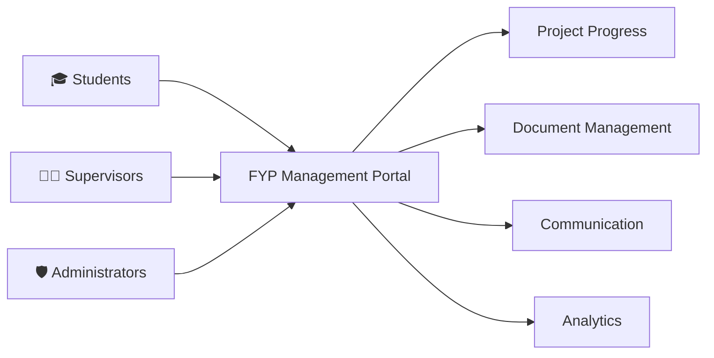
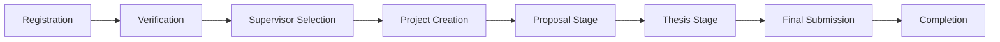
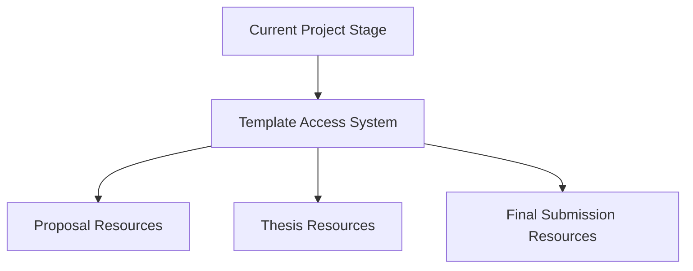
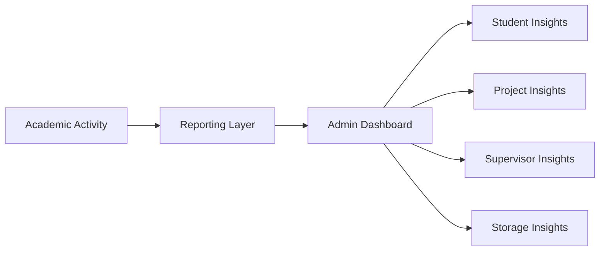
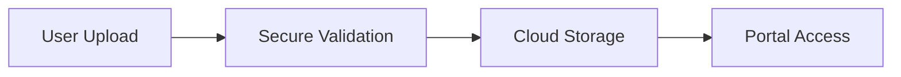
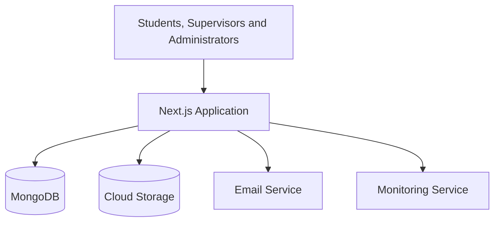
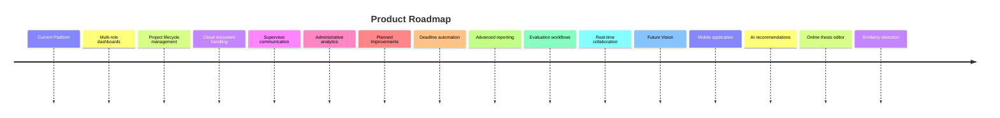

<div align="center">

# 🎓 FYP Management Portal

### A Complete Final Year Project Management Platform

A centralized academic workflow system for managing students, supervisors, projects, submissions, communication, and project progress.

<br />


<br />

**Built with Next.js, TypeScript, MongoDB, and Cloudflare R2**

</div>

---

## 📌 Overview

The **FYP Management Portal** is a full-stack academic management platform designed to streamline the complete Final Year Project lifecycle.

It replaces fragmented processes, manual coordination, and scattered document handling with a structured digital workflow connecting:

* 🎓 Students
* 👨‍🏫 Supervisors
* 🛡️ Administrators

The platform helps academic institutions manage project registration, supervisor allocation, submissions, communication, progress tracking, document storage, and reporting from one centralized system.

---

## 🎯 The Problem

Final Year Project management often relies on:

* Manual student records
* Email-based communication
* Unstructured document submissions
* Spreadsheet-based progress tracking
* Repetitive administrative work
* Limited visibility into project status
* Difficulty monitoring supervisor workload
* Inconsistent access to academic templates

These issues make the process harder to manage for students, supervisors, and university administrators.

---

## 💡 The Solution

The FYP Management Portal provides a role-based academic workspace where every user receives the tools and information relevant to their responsibilities.

Students can manage their project journey, supervisors can monitor and communicate with assigned teams, and administrators can control the overall academic workflow through a centralized dashboard.



---

## ✨ Key Features

### 🎓 Student Experience

* Secure account registration
* University identity verification
* Supervisor selection
* Project and team creation
* Stage-based project progression
* Proposal and thesis submission
* Access to relevant academic templates
* Submission history
* Progress visibility
* Academic notifications

### 👨‍🏫 Supervisor Experience

* View assigned students and teams
* Monitor project progress
* Review student submissions
* Track pending academic tasks
* Send text announcements
* Share voice messages
* Manage communication preferences
* Monitor supervision workload

### 🛡️ Administrator Experience

* Manage students and supervisors
* Approve or reject verification requests
* Search and filter academic records
* Monitor project distribution
* Review submission activity
* Track supervisor workload
* View academic analytics
* Manage project stages
* Perform controlled academic resets
* Monitor storage usage

---

## 🔄 Project Lifecycle

The system follows a structured academic workflow from student onboarding to final project completion.



Each stage unlocks the appropriate actions, resources, and academic templates for the student.

---

## 📚 Stage-Based Template Access

One of the core capabilities of the platform is its intelligent template management system.

Instead of presenting every document at once, the portal gives students access only to the templates required for their current academic stage.



This approach helps:

* Reduce confusion
* Improve submission consistency
* Guide students through the correct workflow
* Prevent access to irrelevant materials
* Standardize academic documentation

---

## 📊 Analytics and Reporting

The administrative dashboard provides visibility into the academic process through centralized analytics.

Available insights include:

* Student statistics
* Verification status
* Supervisor workload
* Project distribution
* Submission activity
* Project stage distribution
* Batch-level analytics
* Program-level analytics
* Storage usage
* Review queues



---

## 📡 Communication System

The portal includes built-in communication tools that help supervisors stay connected with assigned students.

Supported communication channels include:

* 📢 Text broadcasts
* 🎙️ Voice messages
* 🔔 Portal notifications
* ✉️ Academic email notifications

This reduces dependence on external communication platforms and keeps project-related updates connected to the academic workflow.

---

## ☁️ Document Management

Students can securely upload and manage academic documents throughout the project lifecycle.

The platform supports:

* Proposal submissions
* Thesis drafts
* Final deliverables
* Supporting documents
* Voice message storage
* Submission tracking
* Controlled document access



Sensitive implementation details, storage policies, and internal configuration are intentionally not disclosed in this public showcase.

---

## 🔐 Security and Reliability

The platform was designed with security and controlled access as core requirements.

Key protections include:

* Secure authentication
* Role-based authorization
* Protected routes
* Password hashing
* Identity verification
* Input validation
* Rate limiting
* Secure file handling
* Controlled administrative actions
* Transaction-safe operations
* Error monitoring
* Environment-based configuration

The platform separates permissions between students, supervisors, and administrators to ensure that users only access the features and records relevant to their role.

---

## 🏗️ High-Level Architecture

The system follows a modern full-stack web architecture.



The public architecture intentionally remains high-level to present the system without exposing private implementation details.

---

## 🛠️ Technology Stack

| Category             | Technology          |
| -------------------- | ------------------- |
| Full-Stack Framework | Next.js             |
| Frontend Library     | React               |
| Programming Language | TypeScript          |
| Backend              | Next.js Server APIs |
| Database             | MongoDB             |
| Data Modeling        | Mongoose            |
| Authentication       | NextAuth            |
| Cloud Storage        | Cloudflare R2       |
| Monitoring           | Sentry              |
| Deployment           | Vercel              |

---

## Developer setup

For local setup, required environment variables, checks, debugging, and safe operational procedures, read [Developer Setup](docs/Developer%20Setup.md). Copy `.env.example` to `.env.local`; do not commit real credentials.

---

## 🚀 Engineering Highlights

This project demonstrates experience in:

* Designing a complete multi-role platform
* Building role-specific dashboards
* Creating structured academic workflows
* Developing secure authentication and authorization
* Managing cloud-based file storage
* Building stage-controlled feature access
* Designing scalable academic data flows
* Implementing administrative reporting
* Handling account verification
* Creating transaction-safe operations
* Developing reusable UI components
* Managing protected server-side functionality
* Integrating third-party services
* Deploying a production-style full-stack application

---

## 🧠 Key Engineering Challenges

### Multi-Role Access Control

The platform supports three distinct user roles with separate permissions, dashboards, workflows, and actions.

### Academic Workflow Management

Each student progresses through a structured lifecycle, and the platform adapts available features according to the student's current stage.

### Controlled Template Distribution

Academic resources are dynamically presented based on timeline progress rather than exposing every template at once.

### Safe Data Updates

Sensitive administrative actions are designed to protect project consistency and prevent incomplete updates.

### Cloud Document Handling

The platform manages academic documents and media through secure cloud storage while maintaining access references inside the application.

### Supervisor Workload Visibility

Administrative reporting provides visibility into student distribution and supervisor assignments.

---

## 🎨 User Experience Goals

The interface was designed around the following principles:

* Clear role-based navigation
* Simple academic workflows
* Minimal confusion for students
* Fast access to submissions
* Responsive layouts
* Clear status indicators
* Consistent dashboard design
* Accessible project information
* Reduced administrative effort

---

## 📈 Project Impact

The platform is designed to help academic institutions:

* Centralize Final Year Project operations
* Reduce repetitive administrative work
* Improve communication
* Standardize document submissions
* Increase project visibility
* Track student progress
* Monitor supervisor workload
* Organize academic resources
* Improve accountability
* Digitize the complete FYP lifecycle

---

## 🗺️ Future Roadmap

* [ ] Mobile application
* [ ] AI-assisted project recommendations
* [ ] Automated deadline reminders
* [ ] Advanced analytics
* [ ] Online thesis editor
* [ ] Similarity detection integration
* [ ] Real-time messaging
* [ ] Meeting scheduling
* [ ] Evaluation and grading module
* [ ] External examiner portal
* [ ] Project archive and showcase
* [ ] Exportable academic reports



---

## 🔒 Source Code Notice

This repository is intended as a **project showcase**.

The complete source code, internal architecture, database design, private configuration, security rules, and deployment setup are not publicly disclosed.

Access may be provided privately for:

* Technical interviews
* Academic evaluation
* Authorized demonstrations
* Professional review

---

## 📄 Usage and Ownership

This project, its design, documentation, workflows, and implementation are the intellectual work of the project author.

Unauthorized copying, redistribution, resale, or reproduction of the private implementation is not permitted.

---

## 👨‍💻 Author

**Your Name**

Final Year Project Developer

```text
University: University Of Haripur
Department: Information Technology
Program: BS-AI
```

### Contact

```text
LinkedIn: https://www.linkedin.com/in/muhammad-taleeb-raza-6707a9382/
Email: muhammadtaleebraza1@gmail.com
```

---

## 🎓 Project Vision

The FYP Management Portal aims to transform traditional project supervision into a structured, transparent, and efficient digital experience.

It provides one centralized environment for managing:

* Students
* Supervisors
* Projects
* Documentation
* Communication
* Reviews
* Progress tracking
* Academic analytics
* Final submissions

The long-term vision is to provide universities with a scalable platform that improves the Final Year Project experience for every participant.

---

<div align="center">

# 🎓 FYP Management Portal

### From Registration to Final Submission

A modern academic project lifecycle platform built with care, security, and scalability in mind.

<br />


</div>
